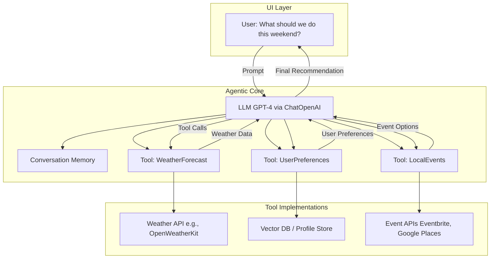

# 🧭 Weekend Planning Assistant (AI Agentic App)

This project is a **Generative AI-based assistant** that helps families decide what to do on the weekend. It uses a **LangChain agentic workflow**, enhanced by real-time weather data, family preferences, and local event information.

---

## ✨ Features

- 🧠 Conversational planning via LLM (e.g., GPT-4)
- 🌦 Weather-aware activity suggestions
- 🗓 Calendar- and availability-aware recommendations
- 📍 Event lookups from real-world APIs
  - [x] Event lookup for Columbus Metro Parks
  - [x] TODO: Event lookup for Columbus Zoo
  - [ ] TODO: Event lookup for The Wilds
  - [ ] TODO: Event lookup for COSI
  - [ ] TODO: Event lookup for Franklin County Conservatory
- 👨‍👩‍👧 Personalized based on family preferences and feedback
- ⚙️ Modular agent/tool design using LangChain

---

## 🏗 Architecture

---

## 🧩 HTML Parser Agent

The project includes an **HTML Parser Agent** (`html_parser_agent.py`) that accelerates the process of extracting event information from new websites. This tool fetches relevant HTML content (such as the `<main>` tag or event containers) and can generate Python parser code to extract structured event data. It is especially useful for quickly adapting the assistant to new event sources, reducing manual effort and boilerplate when integrating new event feeds.

- 🚀 Rapidly generate event parsers for new sites
- 🛠️ Extracts and returns only the most relevant HTML for event listings
- 🤖 Can auto-generate Python code to parse event data into structured formats
