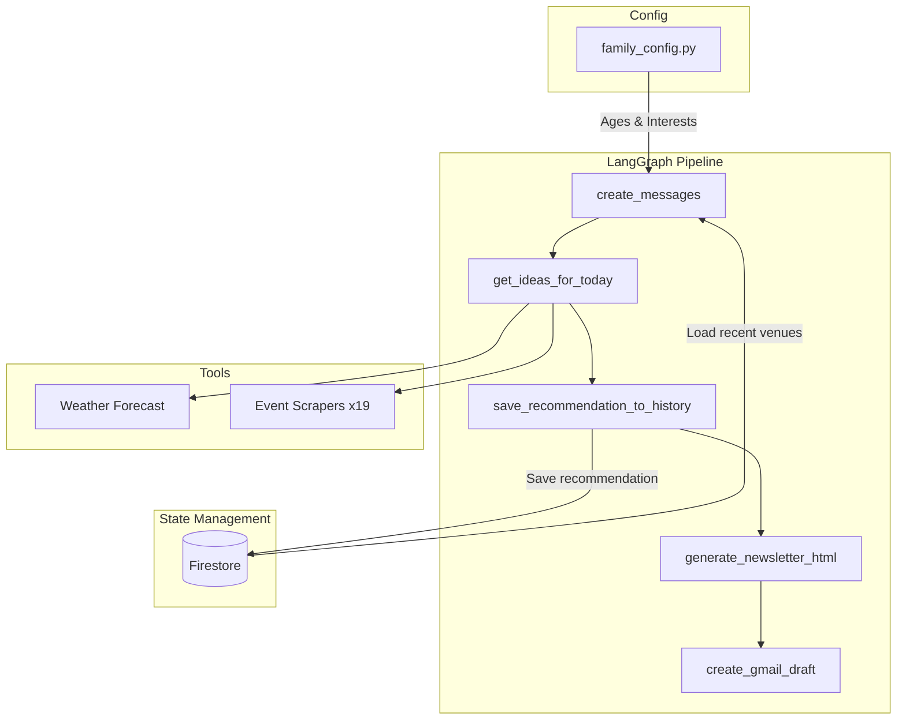

# 🧭 Weekend Planning Assistant (AI Agentic App)

This project is a **Generative AI-based assistant** that helps families decide what to do on the weekend. It uses a **LangGraph agentic workflow** with OpenAI GPT-5.2, enhanced by real-time weather data, family preferences, and local event information.

---

## ✨ Features

- 🧠 AI-powered recommendations via LLM (GPT-5.2)
- 🌦 Weather-aware activity suggestions
- 👨‍👩‍👧 Personalized based on dynamic family config (ages, interests)
- 🔄 Recommendation history to avoid repetitive suggestions (Firestore)
- 📍 19 event scrapers for real-world venues:
  - **Museums:** COSI, Air Force Museum, Franklin Park Conservatory
  - **Zoos/Animals:** Columbus Zoo, Cincinnati Zoo, Newport Aquarium, The Wilds
  - **Amusement Parks:** Kings Island, Cedar Point
  - **Outdoors:** Metro Parks, Hocking Hills, Olentangy Caverns, Lynd Fruit Farm
  - **Festivals:** Ohio Ren Fest, Ohio State Fair, Pumpkin Show
  - **Sports/Entertainment:** Nationwide Arena, Schottenstein Center, Columbus Clippers
- ⚙️ Modular agent/tool design using LangGraph

---

## 🏗 Architecture


```mermaid
graph TD
  subgraph LangGraph Pipeline
    A[create_messages] --> B[get_ideas_for_today]
    B --> C[save_recommendation_to_history]
    C --> D[generate_newsletter_html]
    D --> E[create_gmail_draft]
  end

  subgraph Tools
    B --> T1[Weather Forecast]
    B --> T2[Event Scrapers x19]
  end

  subgraph State Management
    F[(Firestore)] -->|Load recent venues| A
    C -->|Save recommendation| F
  end

  subgraph Config
    G[family_config.py] -->|Ages & Interests| A
  end
```

**Key Patterns:**
- **State Hydration**: Load recommendation history before agent runs
- **Side-Effect Node**: Persist to Firestore without modifying graph state
- **Repository Pattern**: Database abstraction in `recommendation_db.py`

---

## 🧩 HTML Parser Agent

The project includes an **HTML Parser Agent** (`html_parser_agent.py`) that accelerates the process of extracting event information from new websites. This tool fetches relevant HTML content (such as the `<main>` tag or event containers) and can generate Python parser code to extract structured event data. It is especially useful for quickly adapting the assistant to new event sources, reducing manual effort and boilerplate when integrating new event feeds.

- 🚀 Rapidly generate event parsers for new sites
- 🛠️ Extracts and returns only the most relevant HTML for event listings
- 🤖 Can auto-generate Python code to parse event data into structured formats

---

## 🚀 Running the Family Newsletter

### Prerequisites

1. **Google Gmail credentials:**
   - `credentials.json` (OAuth client credentials from Google Cloud Console)
   - `token.json` (created on first run via browser auth)

2. **Firestore (for recommendation history):**
   ```bash
   # Install gcloud CLI
   brew install google-cloud-sdk

   # Authenticate
   gcloud auth application-default login
   ```

3. **Environment variables** (in `.env`):
   ```bash
   OPENAI_API_KEY=sk-...
   FIRESTORE_PROJECT_ID=your-project-id
   OPENWEATHERMAP_API_KEY=...
   ```

### Running

```bash
# Activate virtual environment
source venv/bin/activate

# Run the agent
python family_manager.py
```

### What Happens

1. **State Hydration**: Loads recent venues from Firestore to avoid repetitive suggestions
2. **Weather Check**: Fetches weekend forecast for Columbus, OH
3. **Event Scraping**: Queries 10+ venue scrapers for current events
4. **AI Recommendations**: GPT-5.2 generates personalized suggestions based on:
   - Children's ages (dynamically calculated from `family_config.py`)
   - Children's interests (art, animals, science, etc.)
   - Recent activity history (what to avoid)
   - Current weather conditions
5. **Persistence**: Saves recommendation to Firestore for future reference
6. **Email**: Creates Gmail draft with formatted HTML newsletter

### Troubleshooting

- **Gmail re-auth**: Delete `token.json` and run again
- **Firestore auth**: Run `gcloud auth application-default login`
- **Full setup guide**: See `docs/FIRESTORE_SETUP.md`
